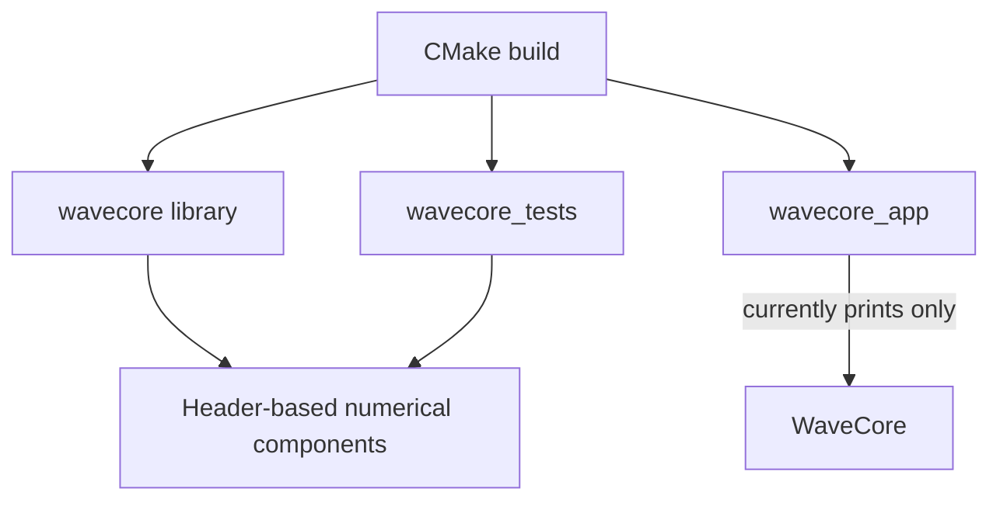
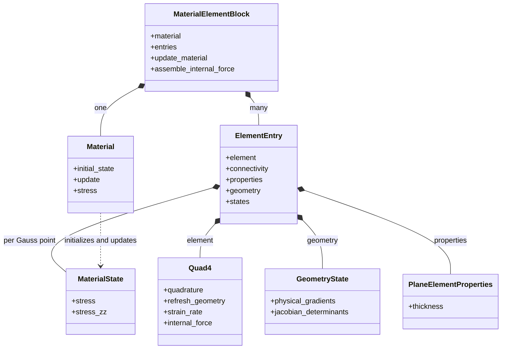
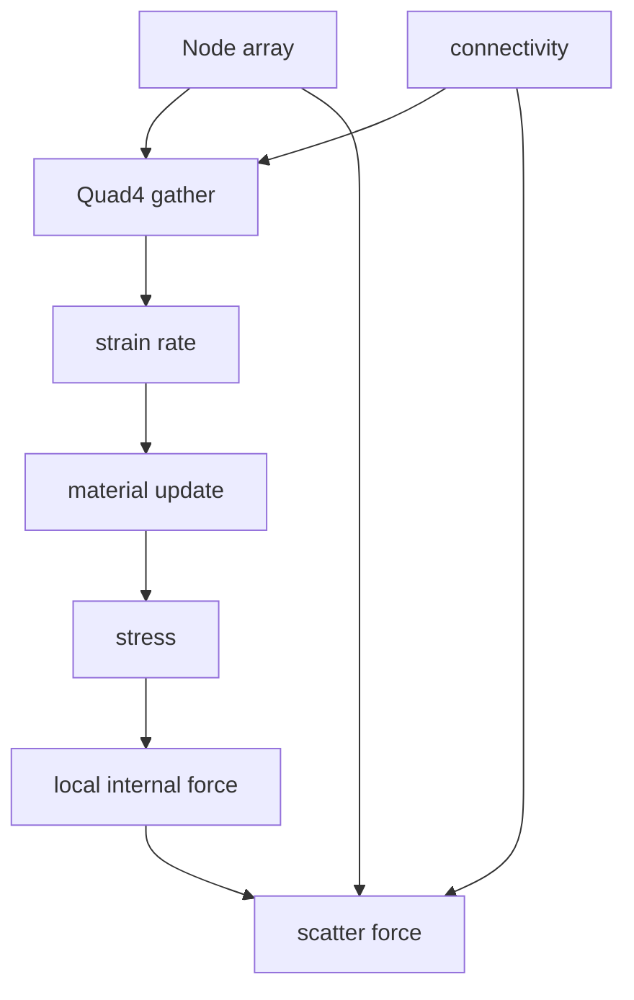
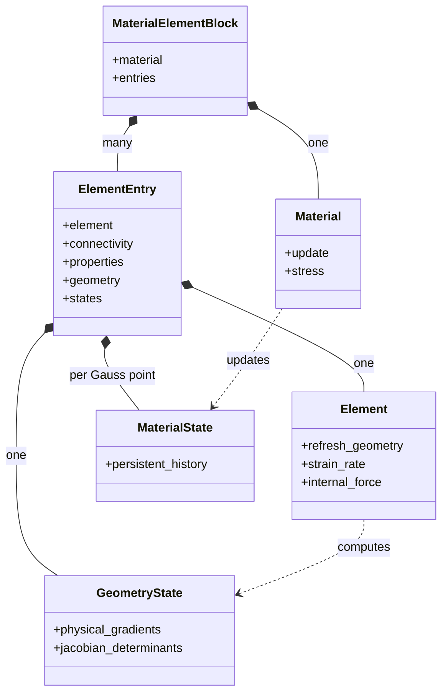
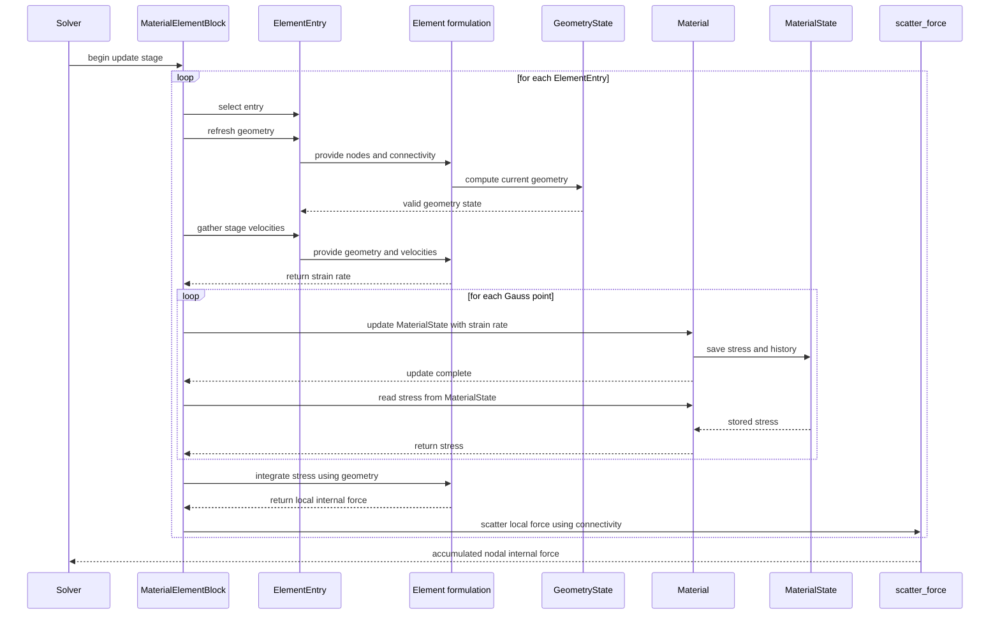
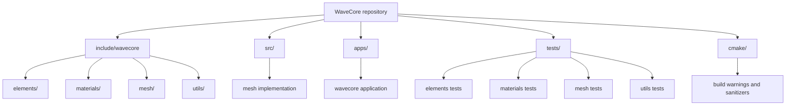

# WaveCore architecture

This document describes the architecture currently present in the repository. WaveCore is a work in progress: several numerical components exist and are tested independently, but they are not yet connected by a solver or simulation loop.

## Current system boundary

The repository currently contains:

- a header-based finite-element core;
- two-dimensional and three-dimensional node types;
- a two-dimensional four-node quadrilateral element;
- a two-dimensional plane-strain elastic material;
- element-level material history storage;
- unit tests for these components; and
- a placeholder application that only prints `WaveCore`.

The executable does not currently construct a mesh, update material state, assemble forces, or advance time. The build wiring is in [CMakeLists.txt](/home/nico/Desktop/WaveCore/CMakeLists.txt), [src/CMakeLists.txt](/home/nico/Desktop/WaveCore/src/CMakeLists.txt), [apps/CMakeLists.txt](/home/nico/Desktop/WaveCore/apps/CMakeLists.txt), and [tests/CMakeLists.txt](/home/nico/Desktop/WaveCore/tests/CMakeLists.txt).



The README describes an earlier 1D bar and ECS-style design. The implemented numerical code is currently centered on 2D finite elements and ordinary value types, so this document follows the source.

## Main data relationships

The current and planned data relationships are represented using a UML class diagram. Composition shows ownership; the material-to-state dependency shows that the material defines and updates states without owning their instances.



The current implementation has not yet added the block or geometry state. The diagram describes the target ownership model; the implementation status is documented in the sections below.

## Nodes and mesh data

[Node.hpp](/home/nico/Desktop/WaveCore/include/wavecore/mesh/Node.hpp) defines `Node<Dimension>`, restricted to dimensions 2 and 3. Each node stores coordinates, displacement, velocity, acceleration, internal force, external force, and mass.

There is no mesh aggregate currently implemented. Connectivity is supplied by callers as arrays or fixed-extent spans. [StructuredQuadMesh.cpp](/home/nico/Desktop/WaveCore/src/mesh/StructuredQuadMesh.cpp) is a source placeholder.

Coordinates and displacement are separate fields, and no current code combines them. `Quad4` reads `coordinates()` directly.

## Element interface and static polymorphism

[IElement.hpp](/home/nico/Desktop/WaveCore/include/wavecore/elements/IElement.hpp) provides common element operation names and forwards calls to concrete implementations using C++23 explicit object parameters. It exposes quadrature, gathering, Jacobian and determinant evaluation, strain-rate evaluation, measure, characteristic length, and internal-force integration.

There are no virtual functions in `IElement`; it is a compile-time forwarding interface. [IElementConcept.hpp](/home/nico/Desktop/WaveCore/include/wavecore/elements/IElementConcept.hpp) checks element traits and operations.

## Quad4

[Quad4.hpp](/home/nico/Desktop/WaveCore/include/wavecore/elements/Quad4.hpp) is the implemented four-node quadrilateral. It is two-dimensional, has four nodes, one Gauss point, uses `Node2D`, and uses `PlaneElementProperties`.

The current implementation owns gathered coordinate and velocity matrices:

```text
coordinates_matrix_
nodal_velocities_
```

`gather()` copies coordinates and velocities from supplied nodes using connectivity. The current Jacobian, strain-rate, and internal-force operations use those gathered caches. The planned architecture moves persistent derived geometry into the entry geometry state.

The element uses parent-square shape functions with nodes ordered bottom-left, bottom-right, top-right, top-left. The one Gauss point is at `(0, 0)` with weight `4`. Internal-force integration validates the Jacobian determinant, computes physical shape gradients, and scales by quadrature weight, determinant, and thickness.

## Element properties

[PlaneElementProperties.hpp](/home/nico/Desktop/WaveCore/include/wavecore/elements/PlaneElementProperties.hpp) stores validated positive plane-element thickness. Thickness belongs to element properties, not the material.

## Material interface and constitutive state

[IMaterialConcept.hpp](/home/nico/Desktop/WaveCore/include/wavecore/materials/IMaterialConcept.hpp) defines the material contract. A material supplies dimension, tensor type, state type, `initial_state()`, `update(state, strain_rate, dt)`, density, and stress evaluation.

[LinearElasticPlaneStrain.hpp](/home/nico/Desktop/WaveCore/include/wavecore/materials/LinearElasticPlaneStrain.hpp) implements two-dimensional isotropic small-strain plane-strain elasticity. Its state stores in-plane stress and `stress_zz`.

The material object supplies constitutive parameters and behavior. It does not own integration-point history; states are passed to it for initialization and update.

## ElementEntry

[ElementEntry.hpp](/home/nico/Desktop/WaveCore/include/wavecore/elements/ElementEntry.hpp) currently binds one element type to one material type and owns:

```text
Element element
connectivity
properties
states[Element::gauss_points]
```

The constructor initializes every material state through `material.initial_state()`. States are independent and remain associated with their Gauss-point index.

The planned design adds one `Element::geometry_state_type` field to each entry. The entry will then bind one element instance to its connectivity, properties, geometry state, and material states.

## Planned geometry state and responsibility boundaries

A concrete element type such as `Quad4` is a stateless formulation object. Its type defines dimension, node type, node count, Gauss points, properties type, geometry-state type, shape functions, and element-specific numerical operations. It computes geometry into caller-supplied state, evaluates strain rates from supplied geometry and velocities, and integrates supplied stresses into local forces.

The architecture has two parallel formulation/state relationships:

| Definition type | Per-entry or per-point state | Meaning |
| --- | --- | --- |
| `Element` | `Element::geometry_state_type` | The element defines how geometry is derived; each entry owns the resulting geometry state. |
| `Material` | `Material::state_type` | The material defines constitutive behavior; each entry owns one state per Gauss point. |

Geometry state is reconstructible derived data. Material state is persistent constitutive history. An `ElementEntry<Element, Material>` binds one element formulation to one geometry state and one material definition to an array of material states indexed by Gauss point.

The later `MaterialElementBlock<Element, Material>` is the higher-level binding. It owns one material definition and many entries of the same element/material combination. The entry binds one element instance to its states; the block binds the shared material definition to the collection and coordinates operations.

For `Quad4`, the planned geometry state contains physical shape-function gradients and Jacobian determinants per Gauss point. Jacobians or inverse Jacobians are stored only if later operations require them.

The ownership relationship is:

```text
MaterialElementBlock
├── one material definition
├── many ElementEntry objects
│   ├── element formulation
│   ├── connectivity
│   ├── element properties
│   ├── geometry state
│   └── material state per Gauss point
└── ...
```

| Component | Responsibility |
| --- | --- |
| Concrete element | Define formulation mathematics and compute or consume supplied geometry state. |
| ElementEntry | Keep one element associated with connectivity, properties, geometry, and material states. |
| Material | Own constitutive parameters and define initialization, updates, and stress evaluation. |
| Typed block | Own one material and many entries; control refresh, updates, assembly, and scattering. |
| Solver or time integrator | Control nodal updates, staging, time increments, and operation timing. |

The planned formulation is updated Lagrangian: geometry is rebuilt from the current nodal configuration whenever nodal positions change, normally at each time step or update stage before material evaluation. The current implementation reads `Node::coordinates()` directly and keeps displacement separate.

## Force scattering

[ScatterForce.hpp](/home/nico/Desktop/WaveCore/include/wavecore/mesh/ScatterForce.hpp) contains the mesh-level assembly utility. It receives nodes, connectivity, and local force vectors, validates connectivity, and accumulates contributions into nodal internal forces without clearing them.

Force clearing is a caller responsibility and should occur once before an assembly pass.

## What is currently connected

The implemented components can be used manually in this order:



No repository component currently performs this complete sequence. The application is not yet a solver or time integrator.

## Planned updated-Lagrangian UML views

The planned architecture separates static ownership from runtime behavior. The class diagram shows which objects own other objects and data. The sequence diagram shows how the block coordinates geometry, kinematics, constitutive updates, force integration, and scattering.

### Static ownership



### Updated-Lagrangian sequence



In the updated-Lagrangian formulation, the block processes each entry in turn. The element computes the entry geometry state from the current nodal configuration, and the same state is used for strain-rate evaluation and force integration. For each Gauss point, the material updates the persistent state and provides stress. The block then asks the element for local force and scatters it through the entry connectivity. Geometry rebuilds do not recreate or reset material states.

## Repository modularity

The repository is organized by responsibility. Public, reusable library interfaces live under `include/wavecore`, implementation files live under `src`, the executable entry point lives under `apps`, and tests are grouped to mirror the library modules. This keeps element formulations, material models, mesh utilities, and numerical utilities independently discoverable.



| Module | Responsibility |
| --- | --- |
| `include/wavecore/elements/` | Element interfaces, formulations, element entries, quadrature, and element properties. |
| `include/wavecore/materials/` | Material concepts, constitutive models, and material state types. |
| `include/wavecore/mesh/` | Nodes and mesh-level operations such as force scattering. |
| `include/wavecore/utils/` | Shared numerical value types and matrix utilities. |
| `src/` | Compiled implementation files that support the library target. |
| `apps/` | Application entry points and executable-specific wiring. |
| `tests/` | Doctest-based tests organized by the module they exercise. |
| `cmake/` | Shared compiler-warning and sanitizer configuration. |

The top-level `CMakeLists.txt` assembles these modules into the `wavecore` library, the `wavecore_app` executable, and the optional `wavecore_tests` target.

## Current source map

| Responsibility | Source |
| --- | --- |
| Build targets | [CMakeLists.txt](/home/nico/Desktop/WaveCore/CMakeLists.txt) |
| Application entry point | [apps/wavecore.cpp](/home/nico/Desktop/WaveCore/apps/wavecore.cpp) |
| Node storage | [Node.hpp](/home/nico/Desktop/WaveCore/include/wavecore/mesh/Node.hpp) |
| Force accumulation | [ScatterForce.hpp](/home/nico/Desktop/WaveCore/include/wavecore/mesh/ScatterForce.hpp) |
| Element forwarding interface | [IElement.hpp](/home/nico/Desktop/WaveCore/include/wavecore/elements/IElement.hpp) |
| Element concept | [IElementConcept.hpp](/home/nico/Desktop/WaveCore/include/wavecore/elements/IElementConcept.hpp) |
| Quadrilateral element | [Quad4.hpp](/home/nico/Desktop/WaveCore/include/wavecore/elements/Quad4.hpp) |
| Element entry | [ElementEntry.hpp](/home/nico/Desktop/WaveCore/include/wavecore/elements/ElementEntry.hpp) |
| Quadrature data | [QuadraturePoint.hpp](/home/nico/Desktop/WaveCore/include/wavecore/elements/QuadraturePoint.hpp) |
| Element thickness | [PlaneElementProperties.hpp](/home/nico/Desktop/WaveCore/include/wavecore/elements/PlaneElementProperties.hpp) |
| Material concept | [IMaterialConcept.hpp](/home/nico/Desktop/WaveCore/include/wavecore/materials/IMaterialConcept.hpp) |
| Plane-strain material | [LinearElasticPlaneStrain.hpp](/home/nico/Desktop/WaveCore/include/wavecore/materials/LinearElasticPlaneStrain.hpp) |
| Mesh behavior tests | [tests/mesh/](/home/nico/Desktop/WaveCore/tests/mesh) |
| Element behavior tests | [tests/elements/](/home/nico/Desktop/WaveCore/tests/elements) |
| Material behavior tests | [tests/materials/](/home/nico/Desktop/WaveCore/tests/materials) |

