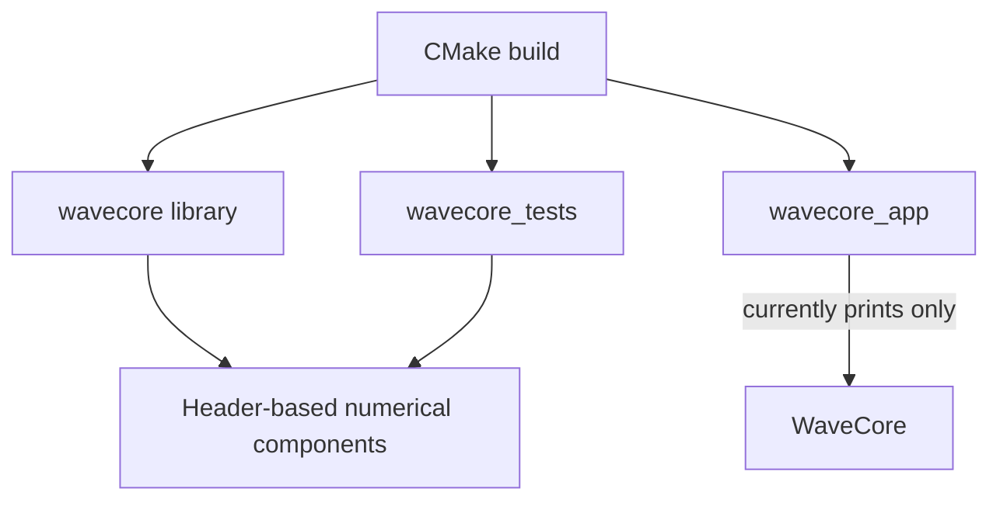
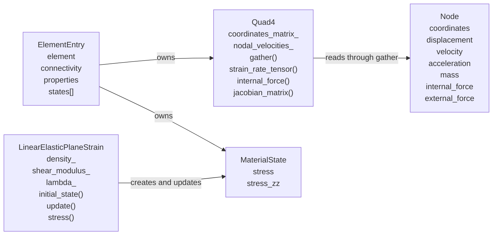
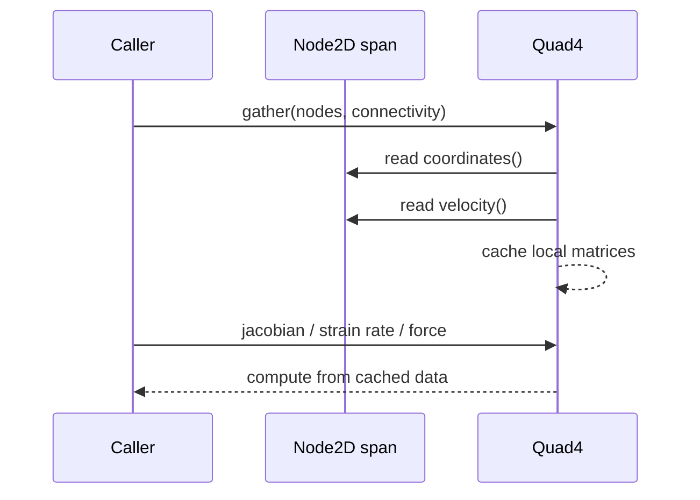
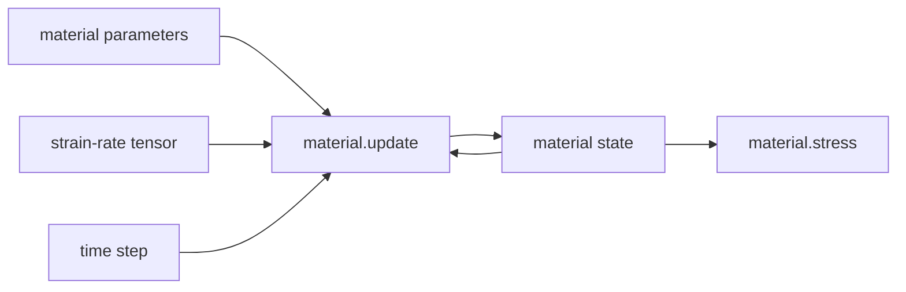
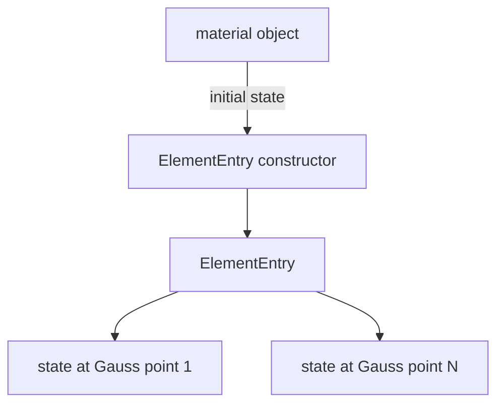
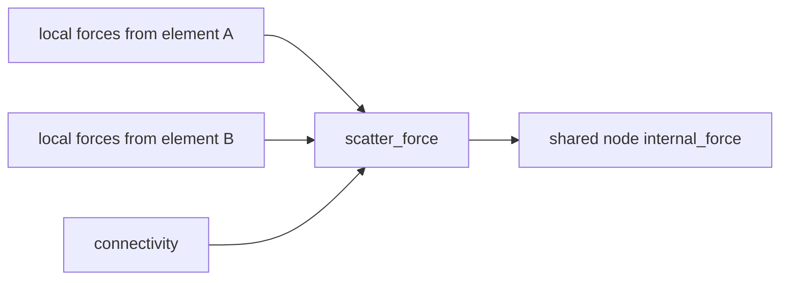
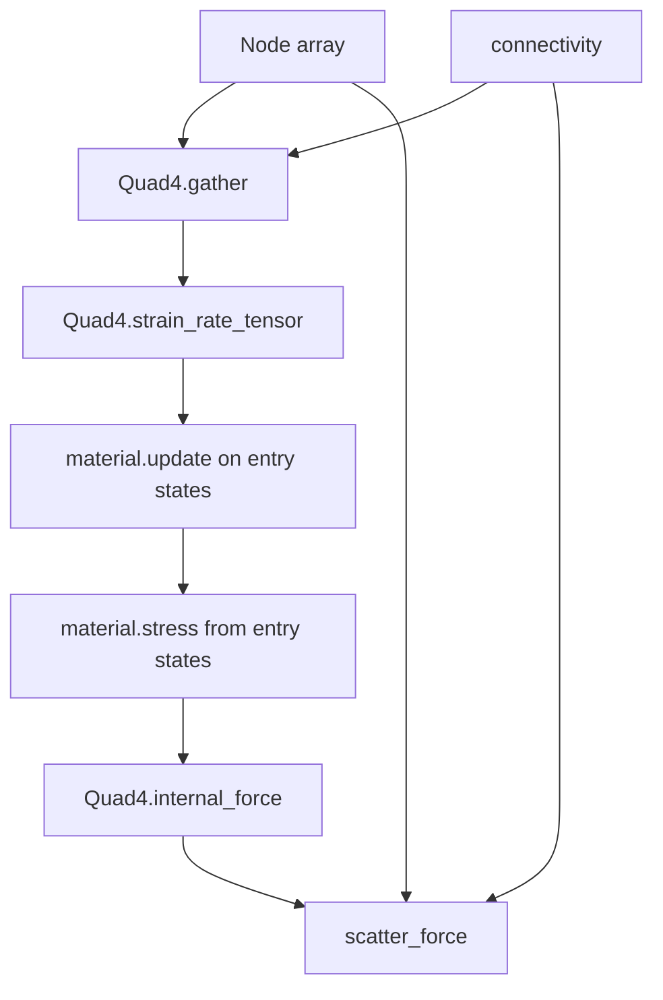
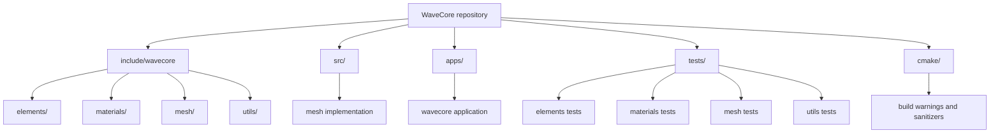

# WaveCore architecture

This document describes the architecture currently present in the repository. WaveCore is a work in progress: several numerical components exist and are tested independently, but they are not yet connected by a solver or simulation loop.

## Current system boundary

The repository currently contains:

- a header-based finite-element core;
- two-dimensional and three-dimensional node types;
- a two-dimensional four-node quadrilateral element;
- a two-dimensional plane-strain elastic material;
- element-level material history storage;
- unit tests for these components; and
- a placeholder application that only prints `WaveCore`.

The executable does not currently construct a mesh, update material state, assemble forces, or advance time. The build wiring is in [CMakeLists.txt](/home/nico/Desktop/WaveCore/CMakeLists.txt), [src/CMakeLists.txt](/home/nico/Desktop/WaveCore/src/CMakeLists.txt), [apps/CMakeLists.txt](/home/nico/Desktop/WaveCore/apps/CMakeLists.txt), and [tests/CMakeLists.txt](/home/nico/Desktop/WaveCore/tests/CMakeLists.txt).



The README describes an earlier 1D bar and ECS-style design. The implemented numerical code is currently centered on 2D finite elements and ordinary value types, so this document follows the source.

## Main data relationships



## Nodes and mesh data

[Node.hpp](/home/nico/Desktop/WaveCore/include/wavecore/mesh/Node.hpp) defines `Node<Dimension>`, restricted to dimensions 2 and 3. `Node2D` and `Node3D` are aliases.

Each node is an object containing fixed-size arrays for coordinates, displacement, velocity, acceleration, internal force, and external force. It also stores a scalar mass. Fields are zero-initialized, and mutable accessors expose displacement, velocity, acceleration, forces, and mass.

There is no mesh aggregate or mesh ownership type currently implemented. Connectivity is supplied by callers as arrays or fixed-extent spans. [StructuredQuadMesh.cpp](/home/nico/Desktop/WaveCore/src/mesh/StructuredQuadMesh.cpp) is currently only a source placeholder and does not provide a structured mesh implementation.

Coordinates and displacement are separate node fields, but no current code combines them. `Quad4` reads `coordinates()` directly.

## Element interface and static polymorphism

[IElement.hpp](/home/nico/Desktop/WaveCore/include/wavecore/elements/IElement.hpp) provides common element operation names. It forwards calls to implementation functions on the concrete element using C++23 explicit object parameters.

The interface exposes quadrature, gathering nodal data, Jacobian and determinant evaluation, strain-rate evaluation, measure, characteristic length, and internal-force integration from supplied stresses.

There are no virtual functions in `IElement`. It is a forwarding base used with compile-time interfaces.

[IElementConcept.hpp](/home/nico/Desktop/WaveCore/include/wavecore/elements/IElementConcept.hpp) checks the concrete element’s static traits and operations. The concept requires a matching `Node<dimension>` type, a properties type, and dimensions/counts greater than zero. It currently permits dimensions 2 and 3.

## Quad4

[Quad4.hpp](/home/nico/Desktop/WaveCore/include/wavecore/elements/Quad4.hpp) is the implemented concrete element. Its traits are:

```text
dimension          = 2
nodes_per_element  = 4
gauss_points       = 1
node_type          = Node2D
properties_type    = PlaneElementProperties
```

The element uses four-node parent-square shape functions. Nodes are ordered bottom-left, bottom-right, top-right, top-left.

`Quad4` owns two cached matrices:

```text
coordinates_matrix_
nodal_velocities_
```

`gather()` copies coordinates and velocities from supplied nodes using supplied connectivity. It does not retain node pointers. The cache remains unchanged until another gather operation.



The Jacobian is formed by multiplying parent-domain shape-function derivatives by the cached coordinate matrix. Physical shape-function gradients are obtained by multiplying the inverse Jacobian by parent derivatives.

The element has one Gauss point at parent coordinates `(0, 0)` with weight `4`, defined by `Quad4::quadrature_impl()`. [QuadraturePoint.hpp](/home/nico/Desktop/WaveCore/include/wavecore/elements/QuadraturePoint.hpp) stores parent coordinates and the parent-domain weight.

The strain-rate operation maps gathered nodal velocities through the inverse Jacobian and symmetrizes the result. The current `Quad4` implementation always evaluates this operation at the element center, even though the public operation accepts parent coordinates.

The internal-force operation accepts one stress tensor per Gauss point and returns one local force vector per element node. It computes the Jacobian, rejects a nonfinite or nonpositive determinant, computes physical shape-function gradients, multiplies stress by those gradients, and scales by quadrature weight, determinant, and thickness. It does not update material state or nodal force storage.

## Element properties

[PlaneElementProperties.hpp](/home/nico/Desktop/WaveCore/include/wavecore/elements/PlaneElementProperties.hpp) currently stores only plane-element thickness. Construction rejects zero, negative, infinite, and NaN values.

`Quad4::internal_force()` uses thickness as part of the integration scale:

```text
quadrature weight × Jacobian determinant × thickness
```

## Material interface and constitutive state

[IMaterialConcept.hpp](/home/nico/Desktop/WaveCore/include/wavecore/materials/IMaterialConcept.hpp) defines the material contract. A material supplies a dimension, tensor type, state type, `initial_state()`, `update(state, strain_rate, dt)`, `density()`, and `stress(state)`.

The material is passed as a const object during these operations. Mutable history is passed separately as `state`.

[LinearElasticPlaneStrain.hpp](/home/nico/Desktop/WaveCore/include/wavecore/materials/LinearElasticPlaneStrain.hpp) implements two-dimensional isotropic small-strain plane-strain elasticity. Its material object stores density and derived Lamé parameters. Its state stores the in-plane stress tensor and `stress_zz`.



The tests verify that updates accumulate in one state without changing another state, and that invalid material parameters and time steps are rejected.

## ElementEntry

[ElementEntry.hpp](/home/nico/Desktop/WaveCore/include/wavecore/elements/ElementEntry.hpp) binds one element type to one material type when their dimensions match. It owns:

```text
Element element
connectivity
properties
states[Element::gauss_points]
```

The material is passed to the constructor by const reference but is not stored. The constructor calls `material.initial_state()` once for every integration point and stores the returned states.

For the current `Quad4`, there is one material state per entry. The tests also define a four-point test element to verify that every integration point receives an independent state.



The entry enforces only dimensional compatibility. It does not establish semantic compatibility between formulations that happen to have the same dimension.

## Force scattering

[ScatterForce.hpp](/home/nico/Desktop/WaveCore/include/wavecore/mesh/ScatterForce.hpp) contains the current mesh-level assembly utility. It receives a node span, a connectivity array, and local force vectors in element-node order.

It validates every connectivity index before modifying any node, then adds local forces into `Node::internal_force()`. Existing force values are preserved.



The tests verify accumulation from two adjacent quadrilaterals sharing nodes. Force clearing is not implemented by this utility; callers are responsible for deciding when to clear nodal internal forces.

## What is currently connected

The implemented components can be used manually in this order:



No repository component currently performs this complete sequence. The application is not a solver, and there is no block or time-integrator type coordinating these calls.

## Repository modularity

The repository is organized by responsibility. Public, reusable library interfaces live under `include/wavecore`, implementation files live under `src`, the executable entry point lives under `apps`, and tests are grouped to mirror the library modules. This keeps element formulations, material models, mesh utilities, and numerical utilities independently discoverable.



| Module | Responsibility |
| --- | --- |
| `include/wavecore/elements/` | Element interfaces, formulations, element entries, quadrature, and element properties. |
| `include/wavecore/materials/` | Material concepts, constitutive models, and material state types. |
| `include/wavecore/mesh/` | Nodes and mesh-level operations such as force scattering. |
| `include/wavecore/utils/` | Shared numerical value types and matrix utilities. |
| `src/` | Compiled implementation files that support the library target. |
| `apps/` | Application entry points and executable-specific wiring. |
| `tests/` | Doctest-based tests organized by the module they exercise. |
| `cmake/` | Shared compiler-warning and sanitizer configuration. |

The top-level `CMakeLists.txt` assembles these modules into the `wavecore` library, the `wavecore_app` executable, and the optional `wavecore_tests` target.

## Current source map

| Responsibility | Source |
| --- | --- |
| Build targets | [CMakeLists.txt](/home/nico/Desktop/WaveCore/CMakeLists.txt) |
| Application entry point | [apps/wavecore.cpp](/home/nico/Desktop/WaveCore/apps/wavecore.cpp) |
| Node storage | [Node.hpp](/home/nico/Desktop/WaveCore/include/wavecore/mesh/Node.hpp) |
| Force accumulation | [ScatterForce.hpp](/home/nico/Desktop/WaveCore/include/wavecore/mesh/ScatterForce.hpp) |
| Element forwarding interface | [IElement.hpp](/home/nico/Desktop/WaveCore/include/wavecore/elements/IElement.hpp) |
| Element concept | [IElementConcept.hpp](/home/nico/Desktop/WaveCore/include/wavecore/elements/IElementConcept.hpp) |
| Quadrilateral element | [Quad4.hpp](/home/nico/Desktop/WaveCore/include/wavecore/elements/Quad4.hpp) |
| Element entry | [ElementEntry.hpp](/home/nico/Desktop/WaveCore/include/wavecore/elements/ElementEntry.hpp) |
| Quadrature data | [QuadraturePoint.hpp](/home/nico/Desktop/WaveCore/include/wavecore/elements/QuadraturePoint.hpp) |
| Element thickness | [PlaneElementProperties.hpp](/home/nico/Desktop/WaveCore/include/wavecore/elements/PlaneElementProperties.hpp) |
| Material concept | [IMaterialConcept.hpp](/home/nico/Desktop/WaveCore/include/wavecore/materials/IMaterialConcept.hpp) |
| Plane-strain material | [LinearElasticPlaneStrain.hpp](/home/nico/Desktop/WaveCore/include/wavecore/materials/LinearElasticPlaneStrain.hpp) |
| Mesh behavior tests | [tests/mesh/](/home/nico/Desktop/WaveCore/tests/mesh) |
| Element behavior tests | [tests/elements/](/home/nico/Desktop/WaveCore/tests/elements) |
| Material behavior tests | [tests/materials/](/home/nico/Desktop/WaveCore/tests/materials) |

