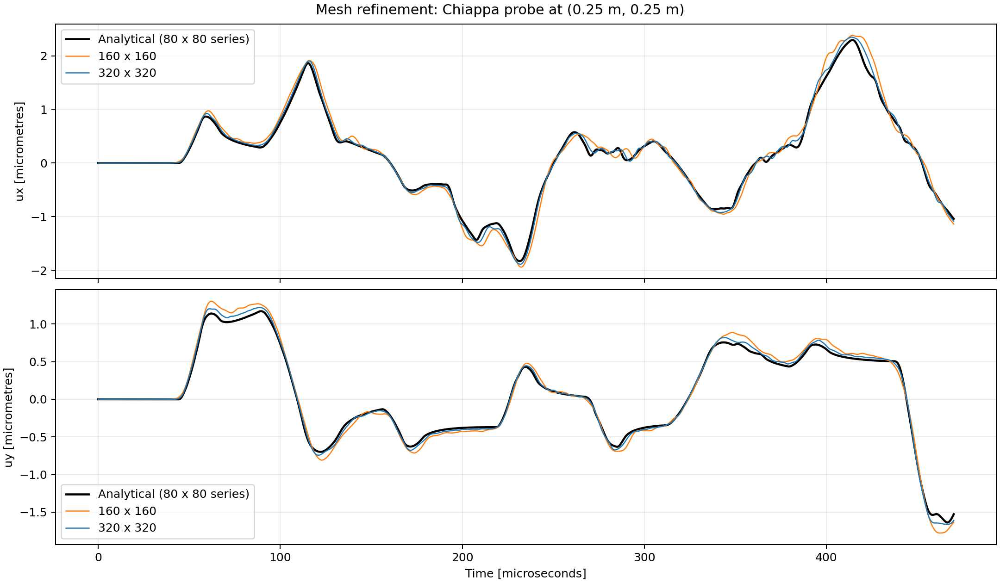
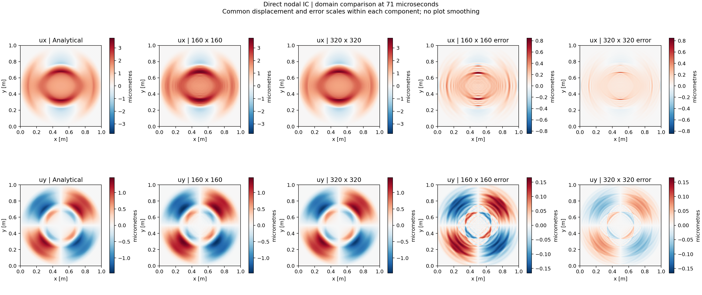

# Chiappa 2D elastic bulk-wave benchmark

## Purpose and reference

This benchmark exercises nodal initialization, geometry refresh, constitutive
updates, force assembly, lumped mass, explicit time integration, boundary
constraints, and scheduled output. It compares numerical displacement fields
and a nodal displacement history against an analytical elastic-wave solution.

The reference implemented in the repository is Chiappa et al., *An analytical
benchmark for a 2D problem of elastic wave propagation in a solid*, Engineering
Structures 229 (2021), 111655, equations (21)–(27). See the
[analytical evaluator](../include/wavecore/benchmarks/ChiappaBulkWave.hpp).
The paper PDF is not distributed with this repository.

This guide covers the implemented bulk-wave case, not every example in the
paper. The numerical model uses square, one-point Quad4 elements; it is not an
identical reproduction of the paper's finite-element discretization.

## Physical and numerical setup

| Quantity | Value |
| --- | --- |
| Domain | Reference square `[0, 1] x [0, 1]` m |
| Material | Isotropic linear elasticity, plane strain |
| Young's modulus | 209 GPa |
| Poisson ratio | 1/3 |
| Density | 7800 kg/m³ |
| Thickness | 1 m |
| Element | Four-node quadrilateral, one central Gauss point |
| Mass | Lumped |
| Damping / hourglass control | Neither enabled |
| Integrator | Explicit two-half-velocity-update leapfrog sequence |
| Maximum timestep | `1e-8` s |
| Critical-timestep safety factor | 0.9 |
| Final time | 470 microseconds |
| History output interval | `1e-7` s (0.1 microseconds) |
| Intermediate domain snapshot | 71 microseconds |
| Analytical series truncation | 80; loops `m=0..80`, `n=1..80` |

Current nodal positions are reference coordinates plus displacement. Geometry
is refreshed in the current configuration, while the material integrates the
linear elastic stress rate. This is a small-amplitude benchmark, not validation
of a complete objective finite-deformation constitutive formulation.

The timestep is not unconditionally fixed: the driver takes the minimum of the
current critical estimate, the configured maximum, and the time to the next
output/final event. Normally the maximum of `1e-8` s controls this case.

### Initial conditions

Initially all displacements and material stresses are zero. Assign velocity
directly to each node using its reference coordinates:

```text
vx = 1 m/s if 0.45 <= x <= 0.55 and 0.45 <= y <= 0.55
vx = 0 otherwise
vy = 0 everywhere
```

The patch is closed: nodes on its edges receive the full velocity. There is no
Fourier-series initialization, smoothing, projection, or averaging. Ordinary
element shape functions still enter the subsequent FEM calculations.

### Boundary conditions and probe

- At `x=0` and `x=1`: `ux=vx=0`; tangential motion is free.
- At `y=0` and `y=1`: `uy=vy=0`; tangential motion is free.
- At corners: both components are constrained.

These are normal-motion constraints, not fully clamped or fully traction-free
edges. Boundary nodes are selected at the actual reference-box edges with a
coordinate tolerance of `1e-12` m.

The history probe is the actual material node initially at `(0.25, 0.25)` m,
not an interpolated sample or a nearest-node search. Its zero-based index is
`(N/4)*(N+1) + N/4`. The analytical evaluator uses those reference coordinates.

### Meshes

| Mesh | Square edge length | Elements / Gauss points | Nodes | Excited nodes | Probe index |
| --- | --- | --- | --- | --- | --- |
| 160 x 160 | 0.00625 m | 25,600 | 25,921 | 289 | 6,480 |
| 320 x 320 | 0.003125 m | 102,400 | 103,041 | 1,089 | 25,760 |

## Build and run

Requirements: CMake, a C++23 compiler (the project uses GCC 14 presets), and
Python 3 with NumPy and Matplotlib for plotting. Use a release build for these
meshes; debug/sanitizer builds are considerably slower.

From the repository root:

```sh
cmake -S . -B build/chiappa-release \
  -DCMAKE_BUILD_TYPE=Release \
  -DCMAKE_CXX_COMPILER=g++-14 \
  -DWAVECORE_ENABLE_TESTS=OFF \
  -DWAVECORE_ENABLE_SANITIZERS=OFF
cmake --build build/chiappa-release --target chiappa_bulk_wave -j2

build/chiappa-release/apps/chiappa_bulk_wave artifacts/chiappa_rerun/nodal_160.csv 160
build/chiappa-release/apps/chiappa_bulk_wave artifacts/chiappa_rerun/nodal_320.csv 320
```

The separate `chiappa_rerun` directory preserves the checked-in reference
artifacts. The application creates the parent directory. Reusing an existing
output basename overwrites its output files.

Command-line syntax is `chiappa_bulk_wave OUTPUT.csv N`. The subdivision count
must be positive and divisible by four. Defaults are `chiappa_snapshot.csv`
and 160. Material parameters, final time, timestep cap, IC, BC, and output
schedule currently live in the [application](../apps/chiappa_bulk_wave.cpp),
not command-line options.

The application defines the problem and writers. The
[dynamics system](../include/wavecore/systems/ExplicitDynamicsSystem.hpp)
initializes the calculation, performs the integration stages, and schedules
history/snapshot callbacks. It is annotated against Belytschko's Box 6.1.

## Output files

For an output basename `nodal_160.csv` (likewise for 320):

| File | Contents |
| --- | --- |
| `nodal_160.csv.initial.csv` | All reference nodal coordinates and assigned initial velocities |
| `nodal_160.csv.history.csv` | Probe displacement from 0 to 470 microseconds, numerical and analytical |
| `nodal_160.csv.71us.csv` | Full domain at 71 microseconds, numerical and analytical |
| `nodal_160.csv` | Full domain at the final time, 470 microseconds |

CSV units are metres, seconds, and metres/second. Snapshot columns are
`x,y,numerical_ux,numerical_uy,analytical_ux,analytical_uy,time`; coordinates are
reference coordinates. History columns are
`time,numerical_ux,numerical_uy,analytical_ux,analytical_uy`.
Initial-condition columns are `x,y,vx,vy`.

Expected history output is 4,701 samples including both endpoints. Snapshot
and IC files have one data row per node. The console reports the excited-node
count and displacement-error summaries at 71 and 470 microseconds.

Do not confuse the final `.csv` with the intermediate `.71us.csv` when
comparing the domain images below.

## Plotting and error reports

The preferred scripts are:

- [plot_chiappa_domains.py](../scripts/plot_chiappa_domains.py): takes the two
  matched-time domain CSVs and an output directory. Produces per-mesh and
  combined analytical/numerical/error fields and prints snapshot relative L2.
- [plot_chiappa_refinement.py](../scripts/plot_chiappa_refinement.py): takes
  the 160 and 320 histories, in that order, and an output image filename.
  Produces the probe comparison and prints three error metrics per component.

```sh
MPLCONFIGDIR=/tmp/wavecore-mpl python3 scripts/plot_chiappa_domains.py \
  artifacts/chiappa_rerun/nodal_160.csv.71us.csv \
  artifacts/chiappa_rerun/nodal_320.csv.71us.csv \
  artifacts/chiappa_rerun/nodal_comparison

MPLCONFIGDIR=/tmp/wavecore-mpl python3 scripts/plot_chiappa_refinement.py \
  artifacts/chiappa_rerun/nodal_160.csv.history.csv \
  artifacts/chiappa_rerun/nodal_320.csv.history.csv \
  artifacts/chiappa_rerun/nodal_comparison/history.png
```

Run the domain script first to create the plotting directory. To replot the
checked-in data instead, replace `chiappa_rerun` with `chiappa_bulk` in both
commands. This overwrites the corresponding PNGs, not the CSV data.

The domain plots show micrometres with common displacement scales across meshes
for each component and separate common error scales. They do not smooth the
plotted fields; their time labels come from the CSVs.

Older single-run helpers also exist:
[plot_chiappa_snapshot.py](../scripts/plot_chiappa_snapshot.py) accepts
`INPUT.csv OUTPUT.png`, and
[plot_chiappa_history.py](../scripts/plot_chiappa_history.py) accepts
`HISTORY.csv OUTPUT.png`. Their labels assume a 71-microsecond snapshot and
a 160 x 160 history respectively. Prefer the paired scripts above for this
refinement comparison.

## Expected results

These values are measured from the checked-in direct-nodal-IC CSVs in
[artifacts/chiappa_bulk](../artifacts/chiappa_bulk). They are reference results,
not newly rerun simulations or strict automated acceptance thresholds. Those
datasets were generated before stepping was moved into the reusable dynamics
driver; small numerical differences after scheduling/build changes should be
assessed rather than requiring byte-for-byte agreement.

| Error metric | 160 x 160 | 320 x 320 |
| --- | --- | --- |
| Domain vector relative nodal L2 at 71 microseconds | 12.8433% | 6.2641% |
| Probe ux relative L2 over full history | 14.6259% | 6.9472% |
| Probe uy relative L2 over full history | 12.4673% | 5.9761% |
| Probe ux peak-normalized RMS | 5.3541% | 2.5431% |
| Probe uy peak-normalized RMS | 4.5650% | 2.1882% |
| Probe ux peak-normalized maximum | 20.6158% | 11.0485% |
| Probe uy peak-normalized maximum | 14.9019% | 7.2185% |

For errors `e = numerical - analytical`, the reported definitions are:

```text
Relative L2 [%] = 100 * sqrt(sum(e²) / sum(analytical²))
Peak-normalized RMS [%] = 100 * sqrt(mean(e²)) / max(abs(analytical))
Peak-normalized maximum [%] = 100 * max(abs(e)) / max(abs(analytical))
```

The field norm sums both displacement components over all nodes; it is an
unweighted discrete nodal norm, not an integrated continuum norm. History
metrics are computed separately for each component over all saved times.
They are not pointwise percentage errors, which become misleading at zero
crossings. Console relative L2 is a fraction; plotting scripts report percent.

Refinement approximately halves the measured errors. The 320 mesh should
visibly track the analytical waveforms and domain patterns more closely.
Two meshes alone do not establish an asymptotic convergence order, and the
different error normalizations should not be interchanged.

### Saved figures

The existing [artifact notes](../artifacts/chiappa_bulk/NODAL_COMPARISON.md)
record the direct nodal initialization and reproduction commands.





Individual field panels:
[160 x 160](../artifacts/chiappa_bulk/nodal_comparison/domain_160.png) and
[320 x 320](../artifacts/chiappa_bulk/nodal_comparison/domain_320.png).

## Verification and limitations

For component and benchmark tests:

```sh
cmake --preset gcc14-debug
cmake --build --preset gcc14-debug -j2
LSAN_OPTIONS=detect_leaks=0 ctest --preset gcc14-debug --output-on-failure
```

The test suite is not a substitute for running both full refinement cases.
The analytical reference is a truncated series, whereas the numerical IC is
a direct nodal discontinuous pulse; finite series and spatial discretization
both affect comparisons near sharp wave fronts.

One-point Quad4 without hourglass control is an intentional benchmark choice,
not a general production recommendation. This case does not validate general
external loads, time-dependent BCs, objective large-deformation material
updates, or a work-consistent energy-balance check. A small displacement error
alone is not evidence that those missing capabilities are implemented.
